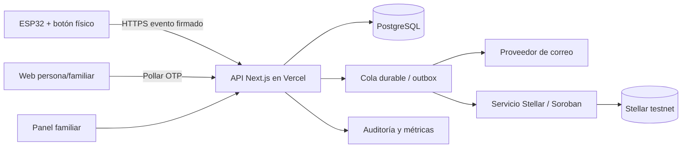

# Pulso — sistema de alerta y seguimiento para emergencias médicas en México

**Estado:** guía de implementación v0.8 · 24 de septiembre de 2026  
**Ámbito:** demo real en Ciudad de México, entrega el 25 de septiembre de 2026; una persona desarrollará el proyecto. Se usará ESP32-WROOM-32 con pulsador mecánico simple, 2–5 participantes y familiares. Para mañana se requiere Wi-Fi y energía disponibles.

> Este documento describe una propuesta técnica y de producto. Una alerta por correo o en el panel no equivale a un reporte recibido por el 911. El equipo no tiene convenio con autoridades: un familiar designado llamará al 911 cuando corresponda y registrará esa acción. En Ciudad de México, el 911 atiende y canaliza urgencias médicas las 24 horas. [Fuente oficial CDMX](https://bomberos.cdmx.gob.mx/servicios/servicio/Emergencias-9-1-1).

## 0. Decisiones pendientes del equipo

| ID | Pregunta | Impacto |
|---|---|---|
| D1 | **Confirmado:** Ciudad de México, sin convenio con autoridades. Pendiente: alcaldía y colonia del piloto | Directorio local y domicilio de atención |
| D2 | Personas objetivo: adultos mayores, pacientes crónicos o público general; ¿uso autónomo o con cuidador? | UX, consentimiento y contenido diario |
| D3 | **Confirmado:** módulo ESP32-WROOM-32 con pulsador mecánico simple en casa con Wi-Fi y energía disponibles mañana. Pendiente: confirmar pines serigrafiados de la placa portadora. Batería y operación sin internet son fase futura | Cableado y firmware |
| D4 | **Confirmado:** familiares atienden las alertas; el equipo no es una empresa. Pendiente: familiar principal, suplente y tiempo máximo para confirmar recepción | Escalamiento |
| D5 | **Confirmado:** entrega mañana, 25 de septiembre de 2026; una persona programará todo y participarán 2–5 usuarios con familiares. Pendiente: número de ESP32 y contactos por persona | Priorización extrema |
| D6 | **Confirmado:** se usarán posibles participantes de prueba reales. Pendiente: número, datos clínicos a almacenar, visibilidad por rol, aviso de privacidad y consentimiento | Modelo de datos y controles de privacidad |
| D7 | **Confirmado:** aún faltan credenciales de correo. Pendiente: proveedor/cuenta y si Gmail API es obligatorio o solo correo recibido en Gmail | Envío y despliegue |
| D8 | **Confirmado:** uso de [Pollar](https://www.pollar.xyz/) para login por correo. Pendiente: crear app y claves de testnet | Integración de login |

### Supuestos provisionales

- Piloto con 2–5 personas adultas que consienten, domicilio fijo, Wi-Fi y electricidad disponibles, y hasta tres contactos de confianza por persona. Un botón de contacto sencillo se conectará a la placa ESP32. El equipo promotor administra la plataforma, sin atribuirse una central de emergencias.
- Interfaz **web** adaptable a teléfono y escritorio, con componentes reales y datos reales durante el piloto. El usuario no necesita operar una wallet para pedir ayuda.
- Se demuestra contrato en **Stellar testnet**; ningún dato clínico, nombre, dirección, correo o coordenada se publica en cadena.
- El sistema **no diagnostica** ni sustituye atención médica. El cuestionario es autorreporte y se muestra como tendencia personal, sin puntajes clínicos inventados.

## 1. PDR: requisitos de producto

### 1.1 Problema y propuesta

Una persona puede necesitar ayuda y no tener el teléfono al alcance. El botón físico del ESP32 inicia una alerta, avisa a familiares designados, la muestra en el panel familiar y conserva una secuencia verificable de acciones. Un chequeo diario opcional permite a la persona y a quienes ella autorice conocer cómo se ha sentido.

### 1.2 Actores

| Actor | Necesita hacer |
|---|---|
| Persona usuaria | Activar ayuda, ver si la alerta fue recibida, completar chequeo diario, gestionar contactos y permisos |
| Familiar/cuidador autorizado | Recibir aviso, confirmar recepción, llamar a la persona y al 911 según el caso, registrar acciones y ver solo la información compartida |
| Administrador del proyecto | Gestionar dispositivos, cuentas, permisos y auditoría; sin acceso clínico por defecto |

### 1.3 MVP para demostración

1. Alta de usuario con correo mediante Pollar y registro de perfil mínimo.
2. Asociación segura de un ESP32 y prueba de conectividad.
3. Activación mediante el botón físico conectado al ESP32 que crea una alerta única; confirmación local con LED si se dispone de él.
4. Envío de correo a contactos y panel familiar con estado del incidente y acuse manual.
5. Pantalla de usuario con estado claro y opción web de «Necesito ayuda».
6. Flujo de escalamiento por un familiar a llamada humana al 911 y bitácora de quién llamó, cuándo y resultado. **No mostrar «autoridad avisada» hasta que exista confirmación real.**
7. Chequeo diario breve y visualización de respuestas históricas para la persona; permisos explícitos para compartir.
8. Contrato Soroban en testnet que ancla eventos del incidente sin datos personales y permite verificar la secuencia.
9. Despliegue web en Vercel con datos persistentes externos y monitoreo básico.

### 1.4 Fuera del MVP

- Integración automática con 911/C5 sin convenio técnico y operativo.
- Diagnóstico, triaje automatizado o recomendaciones médicas personalizadas.
- Rastreo continuo de ubicación con un ESP32 sin hardware o teléfono que la aporte.
- Ubicación en tiempo real: función futura con permiso explícito y un teléfono o módulo de posicionamiento.
- Promesa de entrega inmediata por correo o de atención 24/7 por parte del equipo del proyecto.

### 1.5 Criterios de aceptación y métricas

| Resultado | Criterio para demo | Métrica del piloto |
|---|---|---|
| Control físico | Una activación crea un único incidente; reintentos no lo duplican | Latencia dispositivo → backend y tasa de entrega |
| Contactos | Cada intento de correo queda registrado con estado del proveedor | Tiempo hasta envío y tasa de fallos |
| Familiar | Puede acusar recibo y registrar llamada/acción con sello de tiempo | Tiempo hasta acuse y hasta primer contacto |
| Persona | Ve estados comprensibles: «Alerta enviada», «En revisión», «Ayuda solicitada», «Cerrada» | Comprensión en prueba con usuarios |
| Cadena | Se observa transacción en testnet y coincide con el evento interno | Porcentaje de eventos anclados y retraso |
| Diario | Se completa en pocos pasos y se puede omitir | Tasa de finalización y abandono |

### 1.6 Nombre e identidad verbal

**Nombre elegido por el equipo: Pulso.** Mensaje breve propuesto: **«Tu red de apoyo en un toque»**. En la interfaz usar siempre verbos directos: «Pedir ayuda», «Avisar a mi familia», «Confirmar que recibí la alerta». El MVP no mide la frecuencia cardiaca: «Pulso» es el nombre del proyecto, no una promesa de sensor biométrico. Antes de hacer una marca pública permanente, comprobar registro, dominio y cuentas sociales. Evitar mensajes que sugieran afiliación oficial con 911 o servicios médicos.

## 2. Flujos de extremo a extremo

### 2.1 Alta

Invitación → login con OTP de Pollar → consentimiento y aviso de privacidad → datos mínimos y domicilio de atención → alta de contactos con confirmación de correo → vinculación del dispositivo con código de un solo uso → prueba del botón → pantalla de listo.

### 2.2 Emergencia

Pulsación del botón físico → ESP32 envía evento firmado con identificador de dispositivo, contador y hora del dispositivo si está sincronizado → API registra fecha y hora de recepción e IP pública de origen observada, valida, deduplica y responde → LED indica «recibido por servidor», si está conectado → backend guarda incidente y tareas de aviso → familiares reciben correo con enlace seguro → familiar principal acusa recibo, contacta a la persona y, si corresponde, llama al 911 → registra número de folio **solo si fue proporcionado** → actualización de estado visible para autorizados → cierre con motivo y seguimiento. Si el principal no confirma en el plazo acordado, se avisa al suplente.

Si falla Wi-Fi, el ESP32 señala que no pudo enviar (con LED o buzzer, si están instalados) y reintenta mientras tenga energía. Se debe instruir a la persona a llamar al 911 o pedir a alguien que llame si puede hacerlo; la señal local no debe simular un acuse inexistente. Si el backend recibe la alerta pero falla Stellar, los avisos continúan y el anclaje se reintenta por separado. Batería y conectividad alternativa se diseñarán después del hackathon.

### 2.3 Chequeo diario

Recordatorio opcional → preguntas breves de autorreporte (p. ej. «¿Cómo dormiste?», «¿Cómo te sientes hoy?», «¿Necesitas que te contacten?») → confirmación de guardado → historial simple con fecha → decisión explícita de compartir con cuidador. La respuesta «necesito que me contacten» abre una solicitud de contacto con estado propio; si se interpreta como emergencia, se ofrece activar la alerta.

## 3. UX/UI para personas adultas

### 3.1 Principios verificables

- Una acción principal por pantalla; lenguaje cotidiano y estados concretos.
- Botones grandes (objetivo de diseño: al menos 44 × 44 px), espacio suficiente entre acciones y texto ampliable. WCAG 2.2 AA fija un mínimo de 24 × 24 px para objetivos táctiles con excepciones; 44 × 44 px es una meta cómoda para esta audiencia. [W3C 24 px](https://www.w3.org/WAI/WCAG22/Understanding/target-size-minimum), [W3C 44 px](https://www.w3.org/WAI/WCAG21/Understanding/target-size).
- Texto e icono juntos; no depender solo de color. Contraste y navegación con teclado/lector de pantalla según WCAG 2.2 AA. [W3C](https://www.w3.org/TR/wcag/).
- Confirmación inmediata de acciones y explicación de fallos: «No se pudo enviar. Intenta de nuevo o llama al 911».
- Sin lenguaje de blockchain en el flujo cotidiano; la constancia verificable aparece como detalle del incidente.

### 3.2 Mapa de pantallas

```text
Inicio de sesión
  └─ Alta y permisos
      └─ Inicio: [Necesito ayuda] [Chequeo de hoy] [Estado del dispositivo]
          ├─ Incidente activo → progreso, contactos avisados, botón Llamar al 911
          ├─ Chequeo → una pregunta por paso → resumen → historial
          ├─ Contactos y permisos
          └─ Mi dispositivo → última conexión y prueba

Panel familiar
  ├─ Alertas: nuevas / atendidas / cerradas
  ├─ Detalle: cronología, domicilio, llamada al 911, acciones
  └─ Perfil compartido: solo los datos autorizados por la persona

Panel del proyecto
  └─ Administración: usuarios, dispositivos, permisos y auditoría
```

### 3.3 Prototipo textual interactivo para validar

```text
┌───────────────────────────────────────┐
│ Hola, Ana                             │
│ Botón en casa: conectado a las 10:42  │
│                                       │
│ [ 🔴 NECESITO AYUDA ]                 │
│                                       │
│ [ Hacer mi chequeo de hoy ]           │
│ [ Ver mis contactos de ayuda ]        │
└───────────────────────────────────────┘

Al pulsar «Necesito ayuda»:
┌───────────────────────────────────────┐
│ Estamos enviando tu alerta…           │
│ ✓ Recibida por el sistema             │
│ ○ Familiares: envío en proceso        │
│ ○ Familiar: pendiente de confirmar    │
│                                       │
│ [ Llamar al 911 ]  [ Ver detalles ]   │
└───────────────────────────────────────┘
```

**Prueba de UX requerida:** 3–5 personas del grupo objetivo completan sin ayuda una prueba del dispositivo, identifican si la alerta llegó y terminan el chequeo. Registrar errores, confusiones y tiempo; ajustar antes del piloto.

### 3.4 Comportamiento interactivo mínimo

| Pantalla | Acción | Respuesta visible | Estado de error |
|---|---|---|---|
| Inicio | «Necesito ayuda» | Deshabilitar doble toque, mostrar «Enviando…» y luego `incidentId` | «No pudimos confirmar el envío» y enlace `tel:911` |
| Incidente | «Confirmo que recibí la alerta» (familiar) | Nombre y hora en cronología, visible para otros familiares | Permitir reintento sin crear acuses duplicados |
| Incidente | «Ver detalles» | Mostrar fecha y hora local de recepción; separar «Pulsación estimada» si el reloj del dispositivo estaba sincronizado y «Registro en Stellar» si existe | Si falta hora del dispositivo o anclaje, indicar «No disponible»; nunca inventar una hora |
| Incidente | «Llamé al 911» (familiar) | Pedir hora, resultado y folio opcional; mostrar «Llamada registrada» | Nunca marcar autoridad avisada solo por abrir `tel:911` |
| Chequeo | «Siguiente» | Guardar respuesta local del paso y mostrar progreso «2 de 3» | Conservar respuestas si se interrumpe la sesión |
| Chequeo | «Terminar» | Confirmación con fecha y resumen | Reintentar guardado sin duplicar entrada del día |
| Dispositivo | «Probar conexión» | Señal de prueba etiquetada «Esto es una prueba» | Mostrar último contacto real y pasos de revisión |

Los enlaces de correo llevan a una página con sesión requerida; el correo muestra el mínimo de información necesario. Para la demostración pública usar identidad y domicilio de prueba, aunque el dispositivo, el envío y la transacción sean reales.

### 3.5 Paleta y componentes para empezar a construir

**Concepto visual:** tranquilidad en el uso diario; rojo reservado para pedir ayuda y para incidentes activos. La navegación y los cuestionarios usan verde petróleo y fondos claros. El estado nunca se comunica solo con color: siempre incluye texto e icono.

| Token | Hex | Uso | Contraste de texto comprobado |
|---|---|---|---|
| `--color-background` | `#F7FAFC` | Fondo general | Texto `#172B4D`: **13.45:1** |
| `--color-surface` | `#FFFFFF` | Tarjetas y formularios | Texto `#172B4D`: **14.10:1** |
| `--color-text` | `#172B4D` | Texto principal | Sobre blanco: **14.10:1** |
| `--color-text-secondary` | `#4B5563` | Texto secundario | Sobre blanco: **7.56:1** |
| `--color-primary` | `#0D5C63` | Botones normales, enlaces destacados | Texto blanco: **7.70:1** |
| `--color-danger` | `#B42318` | «Necesito ayuda», incidente activo | Texto blanco: **6.57:1** |
| `--color-success` | `#146C43` | Confirmación recibida | Texto blanco: **6.45:1** |
| `--color-focus` | `#1D4ED8` | Contorno de foco de teclado | Contra blanco: **6.70:1** |
| `--color-border` | `#64748B` | Borde de campos y separadores importantes | Contra blanco: **4.76:1** |

Estos valores se calcularon con la fórmula de luminancia de WCAG para los pares indicados; el contraste final se debe probar de nuevo sobre cada fondo real. WCAG AA pide al menos **4.5:1 para texto normal** y **3:1 para texto grande**. [Criterio W3C](https://www.w3.org/WAI/WCAG21/Understanding/contrast-minimum).

```css
:root {
  --color-background: #f7fafc;
  --color-surface: #ffffff;
  --color-text: #172b4d;
  --color-text-secondary: #4b5563;
  --color-primary: #0d5c63;
  --color-danger: #b42318;
  --color-success: #146c43;
  --color-focus: #1d4ed8;
  --color-border: #64748b;
}
```

**Componentes base:** tipografía del sistema (sin descarga externa), texto de cuerpo de 18 px y altura de línea de 1.5; títulos de 28–32 px; botones de al menos 52 px de alto; controles separados al menos 12 px; tarjetas con borde visible y esquinas de 12 px. El botón «Necesito ayuda» debe ocupar todo el ancho útil en teléfono, con texto e icono, y permanecer en una posición predecible. No usar animaciones que retrasen el acuse de una alerta.

## 4. TRD: arquitectura técnica

### 4.1 Vista general



**Elección provisional:** Next.js + TypeScript en Vercel, PostgreSQL administrado, cola durable (o patrón outbox con trabajador confiable), firmware ESP-IDF o Arduino, contrato Soroban en Rust. Vercel ofrece Queues con entrega al menos una vez y reintentos; por ello los consumidores deben ser idempotentes. [Vercel Queues](https://vercel.com/docs/queues/concepts). Las tareas críticas no dependen de cron de Vercel Hobby: ese plan limita cron a una vez al día y sin precisión horaria; cron tampoco reintenta por sí solo. [Límites de cron](https://vercel.com/docs/cron-jobs/usage-and-pricing), [gestión de cron](https://vercel.com/docs/cron-jobs/manage-cron-jobs).

### 4.2 Componentes y contratos

| Componente | Responsabilidad | Contrato inicial |
|---|---|---|
| ESP32 | Detectar activación física, reintentar, mostrar estado si el hardware lo permite | `POST /api/device-events` con `deviceId`, `eventId`, `counter`, `devicePressedAtUtc?`, firma |
| API de dispositivos | Autenticar y deduplicar; crear incidente | Respuesta con `incidentId`, `accepted`, `serverTime` |
| Incidentes | Máquina de estados y permisos | `created → family_acknowledged → contacting → resolved/false_alarm` |
| Notificaciones | Fan-out a contactos, reintentos, trazabilidad | Estado por destinatario: queued/sent/failed/acknowledged |
| Autenticación | OTP por correo con Pollar; sesión y wallet | Asociar identidad autenticada a rol interno |
| Diario | Guardar respuestas y permisos de lectura | Entradas fechadas, editables conforme a política |
| Stellar | Anclar secuencia de incidentes | Eventos con ID seudónimo, tipo de transición y compromiso criptográfico |

La documentación pública de Pollar muestra OTP por correo y un ejemplo con Next.js/testnet, pero sus SDK y endpoints cambian; al implementar se fijará una versión compatible y se verificará la guía vigente. [SDK](https://github.com/pollar-xyz/pollar), [ejemplo Next.js](https://github.com/pollar-xyz/pollar-docs/blob/main/docs/getting-started/example-app.md).

### 4.3 Modelo de datos mínimo

```text
users(id, pollar_subject, role, email, created_at)
profiles(user_id, display_name, phone?, address_encrypted?, consent_version)
contacts(id, user_id, name, email, relationship, verified_at, permissions)
devices(id, user_id, public_id, secret_ref, last_counter, last_seen_at, status)
device_events(id, device_id, event_id, counter, device_pressed_at_utc?, server_received_at_utc, source_ip_encrypted?, source_channel)
incidents(id, user_id, device_id?, status, opened_at_utc, closed_at_utc?, address_snapshot_encrypted?)
incident_events(id, incident_id, seq, type, actor_id?, server_received_at_utc, metadata_private)
notifications(id, incident_id, contact_id, channel, status, attempts, provider_id?)
daily_checkins(id, user_id, day, answers_encrypted, share_scope)
chain_anchors(id, incident_event_id, tx_hash?, network, ledger_closed_at_utc?, status, retries)
audit_log(id, actor_id, action, object_type, object_id, at)
```

Índices únicos: `device_events.event_id`, `(device_id, counter)` y `(incident_id, seq)` para controlar reintentos. Los contactos se verifican antes de activarse. La ubicación inicial es el domicilio registrado; un ESP32 con Wi-Fi no produce una ubicación GPS confiable por sí mismo.

**IP y tiempos del incidente.** La API toma `source_ip` de la solicitud entrante mediante el mecanismo confiable de Vercel, nunca de un campo enviado por el ESP32 o navegador. En el botón físico normalmente será la IP pública del router doméstico; en el botón web será la de la conexión del navegador. Puede cambiar, compartirse o reflejar una VPN; **no identifica con certeza a una persona ni proporciona una ubicación precisa**. Guardarla cifrada, con acceso restringido de auditoría y plazo de conservación definido en el aviso de privacidad; no incluirla en correos, panel familiar ni exploradores públicos. [Cabeceras de Vercel](https://vercel.com/docs/headers/request-headers), [función `ipAddress`](https://vercel.com/docs/functions/functions-api-reference/vercel-functions-package).

Guardar tres tiempos distintos en UTC/ISO 8601: `device_pressed_at_utc` (informativo y opcional, solo si el ESP32 sincronizó su reloj; puede ser inexacto), `server_received_at_utc` (creado por la API al recibir el evento y referencia operativa para los avisos) y `ledger_closed_at_utc` (obtenido de Stellar una vez confirmada la transacción). Registrar `source_channel = esp32|web` para interpretar la IP. En la interfaz mostrar la fecha y hora convertidas a `America/Mexico_City`, con la zona horaria visible. Los reintentos conservan los tiempos del primer evento aceptado y no crean incidentes nuevos. Stellar expone la hora de cierre del ledger en sus resultados de eventos. [Referencia `getEvents`](https://developers.stellar.org/docs/data/apis/rpc/api-reference/methods/getEvents).

**Ubicación futura.** Mantener hoy el domicilio de atención confirmado por la persona. Para una ubicación actual, pedir permiso explícito en la web y usar la geolocalización del teléfono, o agregar hardware de posicionamiento/conectividad al dispositivo. Guardar coordenadas cifradas fuera de cadena, con vigencia limitada y acceso solo a contactos autorizados. No usar la IP como sustituto de una dirección para enviar ayuda.

### 4.4 Seguridad, privacidad y salud

- La [Ley Federal de Protección de Datos Personales en Posesión de los Particulares vigente](https://www.ordenjuridico.gob.mx/Documentos/Federal/html/wo125102.html) trata los datos de salud como sensibles. Diseñar aviso de privacidad, finalidad específica, consentimiento expreso para salud, acceso/corrección/cancelación/oposición según proceda, retención y controles de acceso antes de usar datos reales.
- Guardar datos clínicos y domicilio cifrados fuera de cadena; mínimo privilegio por rol y registro de cada consulta de un familiar o administrador.
- Tratar la IP vinculada al incidente y las futuras coordenadas como datos personales en el diseño de privacidad: finalidad, acceso y eliminación definidos; nunca registrar estos valores en logs públicos ni en Stellar.
- Contrato y eventos solo con identificadores aleatorios y compromisos generados con un `nonce` aleatorio por evento; evitar hashes simples de datos predecibles. La bitácora de base de datos es operativa, mientras Stellar aporta una prueba verificable de integridad temporal.
- Autenticación por persona con Pollar; el ESP32 usa credenciales de dispositivo distintas, revocables y nunca una wallet de usuario.
- Cifrar el transporte, proteger secretos en variables de entorno, limitar solicitudes, rotar credenciales y probar pérdida de Wi-Fi/energía.
- Gmail API permite enviar por `messages.send`, pero sus límites y errores impiden usar un HTTP 200 como garantía de entrega. Para incidentes reales se necesita seguimiento de fallos y un canal alterno según protocolo. [Envío](https://developers.google.com/workspace/gmail/api/guides/sending), [límites y errores](https://developers.google.com/workspace/gmail/api/guides/handle-errors).

### 4.5 Contrato Stellar propuesto

**Propósito:** dejar una constancia verificable de que Pulso registró la apertura, el acuse familiar y el cierre de un incidente. Stellar es una cadena pública: cualquiera puede ver transacciones y eventos; por eso el contrato no debe recibir datos personales ni clínicos. [Privacidad en Stellar](https://developers.stellar.org/docs/build/apps/privacy).

#### Datos visibles en Stellar testnet

| Campo | Tipo sugerido | Finalidad | Quién lo genera |
|---|---|---|---|
| `case_key` | 32 bytes aleatorios | Identificar el incidente sin exponer el ID interno ni a la persona | Backend |
| `seq` | Entero creciente | Ordenar eventos y rechazar duplicados | Backend/contrato |
| `event_code` | Enum corto: `OPENED`, `FAMILY_ACK`, `CLOSED`, `FALSE_ALARM` | Ver la etapa general del incidente | Backend |
| `server_received_at_unix` | Segundos Unix en UTC | Asociar una fecha y hora de recepción declarada por el backend a cada evento | Backend; el contrato solo comprueba formato/orden básico, no que la emergencia ocurrió a esa hora |
| `commitment` | SHA-256 de `version || case_key || seq || event_code || server_received_at_unix || registro_canonico || nonce` | Probar que el registro privado no cambió | Backend, con `nonce` aleatorio de 32 bytes por evento |
| Cuenta firmante | Dirección Stellar de servicio | Autorizar la escritura y pagar comisiones | Proyecto Pulso |
| `contract_id`, `tx_hash`, ledger y hora de cierre de ledger | Metadatos de la red | Consultar y verificar cada anclaje | Stellar |

El `nonce`, el registro completo (incluidas la IP y las horas privadas) y el vínculo `case_key ↔ persona` permanecen **fuera de cadena**. Para una auditoría, Pulso entrega a una persona autorizada el registro y su `nonce`; esa persona recalcula el hash y lo compara con `commitment`. No usar un hash directo del nombre, correo, domicilio, IP o respuestas de salud: esos valores pueden adivinarse. El `event_code`, `server_received_at_unix` y la hora de la transacción son públicos, así que el esquema reduce exposición pero no ofrece anonimato total. La hora del ledger es independiente de la hora declarada por el backend y sirve para comprobar que el anclaje ya existía al cierre de ese ledger.

#### Funciones y reglas del contrato

```text
initialize(admin_address)
record_event(case_key, seq, event_code, server_received_at_unix, commitment)
get_case_state(case_key) -> (last_seq, closed)
```

- `initialize` configura la cuenta de servicio autorizada una sola vez.
- `record_event` exige autorización de esa cuenta (`require_auth()`), `seq = last_seq + 1` y que el caso no esté cerrado. `OPENED` solo se acepta con `seq = 1`; `CLOSED` y `FALSE_ALARM` cierran el caso. Publica un evento con los cinco parámetros de la función. `server_received_at_unix` debe ser un entero positivo; si se compara con la hora del ledger, usar una tolerancia documentada. El contrato no puede certificar por sí solo la hora real de la pulsación. [Autorización Stellar](https://developers.stellar.org/docs/build/guides/auth/contract-authorization), [eventos](https://developers.stellar.org/docs/build/smart-contracts/example-contracts/events).
- El contrato guarda solo `last_seq` y `closed` por `case_key` para impedir repeticiones. Ese estado tiene TTL en Stellar y requiere estrategia de extensión/restauración si se necesita consultar a largo plazo. [Archivo de estado](https://developers.stellar.org/docs/learn/fundamentals/contract-development/storage/state-archival).
- Una cuenta del backend firma las transacciones: el ESP32 y los familiares **no esperan una wallet ni una confirmación de Stellar** para pedir o atender ayuda. Pollar identifica a las personas en la web; las cuentas embebidas no son requisito para activar el botón.

#### Datos que nunca van al contrato

Nombre, correo, teléfono, IP pública o local, dirección, coordenadas, diagnósticos, medicamentos, respuestas diarias, texto del incidente, contacto familiar, folio del 911, fotografías, dirección de la wallet personal creada por Pollar o identificadores internos de la base de datos.

#### Relación con el backend y límites de la prueba

El backend guarda el incidente y envía avisos primero; luego coloca el anclaje en una cola independiente. En `chain_anchors` conserva `case_key`, `seq`, `commitment`, `tx_hash`, ledger, `ledger_closed_at_utc` y estado del reintento. Si Stellar falla, el aviso familiar continúa y el anclaje se reintenta. Stellar prueba que **un compromiso de datos fue registrado a más tardar al cierre de ese ledger**; no prueba que ocurrió una emergencia, que el correo se entregó ni que se llamó al 911. Esos hechos requieren registros y confirmaciones externas.

Para historial más largo, guardar los eventos y `tx_hash` en la base de datos o un indexador: `getEvents` de Stellar RPC conserva una ventana reciente, normalmente alrededor de siete días. [Ingesta de eventos](https://developers.stellar.org/docs/build/guides/events/ingest), [referencia `getEvents`](https://developers.stellar.org/docs/data/apis/rpc/api-reference/methods/getEvents).

### 4.6 Conexión real del botón con ESP32

Para el **pulsador mecánico normalmente abierto de dos terminales** y una placa portadora de ESP32-WROOM-32 que exponga `GPIO27`, el esquema es:

```text
GPIO27 del ESP32 ─── terminal 1 del botón
GND del ESP32    ─── terminal 2 del botón
```

Configurar `GPIO27` como entrada con `INPUT_PULLUP`: reposo = HIGH, pulsado = LOW. En firmware, esperar 30–50 ms de estabilidad para filtrar rebote y exigir una activación deliberada (por ejemplo, mantener 1–2 s, pendiente de prueba con usuarios). **Verificar que la placa portadora expone `GPIO27` y GND antes de cablear.** El módulo WROOM-32 puede venir montado en distintas placas. Si el pulsador tiene cuatro patas, identificar con multímetro los dos pares internamente unidos y conectar una pata de cada lado del interruptor. No conectar 5 V ni 3.3 V al botón en este esquema. El ESP32 nunca envía correos ni firma transacciones Stellar: solo comunica el evento a la API por HTTPS. Espressif documenta `GPIO27` en la placa DevKitC y la resistencia pull-up interna. [Pinout](https://docs.espressif.com/projects/esp-dev-kits/en/latest/esp32/esp32-devkitc/user_guide.html), [GPIO Arduino](https://docs.espressif.com/projects/arduino-esp32/en/latest/api/gpio.html).

**Ruta de validación para mañana:** (1) probar que el monitor serie registra una sola activación por pulsación; (2) configurar SSID/contraseña del Wi-Fi de prueba; (3) enviar `POST /api/device-events` por HTTPS con verificación de certificado; (4) confirmar `incidentId` en la respuesta; (5) verificar que aparece en web y llega correo familiar; (6) desconectar Wi-Fi y comprobar que no aparece un falso acuse; (7) reconectar y verificar reintento sin duplicado. Espressif documenta provisión Wi-Fi y cliente HTTPS con verificación de certificado. [Provisión](https://docs.espressif.com/projects/esp-idf/en/stable/esp32/api-reference/provisioning/index.html), [cliente HTTP](https://docs.espressif.com/projects/esp-idf/en/v6.0/esp32/api-reference/protocols/esp_http_client.html).

**Fase futura:** batería/UPS para el ESP32 y router, o conectividad celular de respaldo. Un ESP32 con Wi-Fi no puede transmitir una alerta a internet si se cae la red doméstica.

### 4.7 Despliegue en Vercel

1. Repositorio Git con app Next.js, firmware y contrato en carpetas separadas.
2. Proyecto Vercel para la web/API; base de datos y cola administradas fuera del sistema de archivos de las funciones.
3. Variables separadas para preview y producción: claves Pollar públicas/secretas, base de datos, correo, firma de dispositivos y cuenta Stellar. Ninguna clave secreta en `NEXT_PUBLIC_*`.
4. `preview` con datos sintéticos y Stellar testnet; revisión de roles, correo, reintentos, recuperación y accesibilidad.
5. Dominio HTTPS; migraciones de DB controladas; alertas de errores y copias de seguridad verificadas.

### 4.8 Configuración que falta antes de la demo

| Servicio | Acción concreta | Comprobación |
|---|---|---|
| Pollar | Crear aplicación en testnet, habilitar login por email OTP, obtener clave publicable y clave secreta; fijar versión compatible de `@pollar/react` y `@pollar/core` | Un participante inicia sesión desde la URL HTTPS de Vercel y regresa con sesión activa. [Ejemplo oficial](https://github.com/pollar-xyz/pollar-docs/blob/main/docs/getting-started/example-app.md) |
| Correo | Decidir si se necesita **enviar desde una cuenta Gmail** o solo **entregar a familiares con Gmail**. Si se elige Gmail API, crear proyecto Google Cloud, habilitar Gmail API, configurar OAuth y solicitar `gmail.send` para la cuenta emisora | Enviar un correo de prueba desde el backend a un familiar y confirmar recepción. [Inicio Gmail API](https://developers.google.com/workspace/gmail/api/quickstart/nodejs), [permiso `gmail.send`](https://developers.google.com/workspace/gmail/api/auth/scopes?hl=es-419) |
| Base de datos | Crear PostgreSQL administrado y guardar URL de conexión en Vercel; ejecutar migraciones | Incidente persiste al recargar la web |
| Stellar | Crear cuenta de despliegue en testnet, fondearla con el mecanismo de testnet y desplegar contrato Soroban | Guardar `contractId`, `tx_hash` y enlace al explorador; verificar evento. [CLI Stellar](https://developers.stellar.org/docs/tools/cli/stellar-cli) |
| Dispositivo | Configurar Wi-Fi de la casa y credencial **propia del dispositivo** | Pulsación física desde el ESP32 crea incidente en URL pública |

**Variables de entorno previstas:** `NEXT_PUBLIC_POLLAR_PUBLISHABLE_KEY`, `POLLAR_SECRET_KEY`, `DATABASE_URL`, credenciales del proveedor de correo, `STELLAR_NETWORK=testnet`, `STELLAR_CONTRACT_ID`, secreto de firma del dispositivo. Los nombres exactos de correo y firma se fijan al elegir la implementación. Nunca enviar secretos por chat, publicarlos en Git ni usar el prefijo `NEXT_PUBLIC_` para claves privadas.

### 4.9 Participantes reales de prueba

Antes de registrar a alguien, explicar que es un **prototipo de hackathon**, obtener aceptación explícita para recibir alertas de prueba y definir quién actuará si aparece una emergencia verdadera. Para la demostración pública, mantener el teléfono y correo reales en el backend, pero mostrar nombre, domicilio y respuestas de salud ficticios o enmascarados en proyector/capturas. Separar un modo de **simulacro** que marque claramente los mensajes como prueba y no llame automáticamente al 911. No capturar historial clínico detallado hasta cerrar consentimiento, permisos y retención. El carácter sensible de los datos de salud consta en la [ley federal vigente](https://www.ordenjuridico.gob.mx/Documentos/Federal/html/wo125102.html).

## 5. Plan de implementación por tickets

| ID | Ticket | Dependencia | Terminado cuando… |
|---|---|---|---|
| T01 | Cerrar protocolo familiar y alcance piloto en CDMX | D1–D5 | Hay familiar principal/suplente, plazos, escalamiento y mensajes aprobados |
| T02 | Aviso de privacidad, consentimiento y matriz de acceso | T01, D6 | Pantallas y permisos revisados para datos sensibles |
| T03 | Monorepo y despliegue preview en Vercel | — | URL de preview y CI funcionales |
| T04 | PostgreSQL, migraciones y seed sintético | T03 | Modelo e índices creados |
| T05 | Pollar OTP y roles | T03, D8 | Usuario entra y no ve datos de otro rol |
| T06 | Perfil, contactos verificados y vinculación de dispositivo | T04–T05 | Se completa alta y prueba del dispositivo |
| T07 | Firmware ESP32: GPIO, HTTPS, firma, reintento y LED opcional | T06, D3 | Prueba física con Wi-Fi caído y restaurado |
| T08 | Ingesta API, deduplicación, IP observada y tres tiempos del evento | T04, T07 | Un evento produce un incidente; IP privada y horas UTC correctas en cronología |
| T09 | Cola/outbox y correos con seguimiento de fallo | T08 | Se ve estado por destinatario; reintento idempotente |
| T10 | Panel familiar y protocolo de llamada | T08 | Acuse, acciones y cierre quedan auditados |
| T11 | Panel usuario accesible y estado del incidente | T05, T08 | Prueba de tareas con personas del grupo objetivo |
| T12 | Chequeo diario y permisos de lectura | T02, T11 | Respuestas e historial visibles solo a autorizados |
| T13 | Contrato Soroban y pruebas en testnet | T08 | Apertura/transición/cierre con `server_received_at_unix` verificables en explorador |
| T14 | Trabajador de anclaje y conciliación | T09, T13 | Fallo de Stellar no bloquea alertas; luego se recupera |
| T15 | Prueba de extremo a extremo y simulacro | T07–T14 | Se demuestra botón → aviso → familiar → cierre → prueba en cadena |
| T16 | Producción piloto y monitoreo | T15 | Secretos, backups, observabilidad y responsables configurados |
| T17 | Ubicación actual opcional con consentimiento | Después del MVP | Permiso explícito, precisión indicada, vigencia limitada y acceso familiar autorizado |

### Ruta crítica para una sola persona y entrega mañana

El alcance demostrable debe ser **un ESP32 y un botón físico, 2–5 personas usuarias con sus familiares, correos reales y al menos una transacción en Stellar testnet**. Son interacciones reales, aunque testnet no es la red principal y el ejercicio con participantes debe tratarse como simulacro hasta validar la operación y privacidad. Si solo hay una placa, vincularla a una persona para la demostración física; las demás pueden probar login, panel y chequeo web.

| Orden | Entregable del día | Tickets | Condición para avanzar |
|---|---|---|---|
| 1 | App Next.js desplegada en Vercel y base de datos conectada | T03–T04 | Endpoint de salud responde desde URL pública |
| 2 | Incidente creado desde un botón **web** de prueba y visible en pantalla familiar | núcleo de T08 y T11 | Mismo `incidentId` en API y pantalla |
| 3 | Correo real a un familiar de prueba | núcleo de T09 | Mensaje recibido y enlace abre el caso |
| 4 | Botón físico ESP32 → API pública | núcleo de T07 | Pulsación crea el mismo tipo de incidente |
| 5 | Pollar OTP | T05 | Usuario inicia sesión y accede solo a su caso |
| 6 | Contrato simple en Stellar testnet y anclaje de apertura | núcleo de T13–T14 | `tx_hash` visible y asociado al incidente |
| 7 | Chequeo diario de tres preguntas y cierre del caso | núcleo de T12 y T10 | Respuestas guardadas y cronología cerrada |
| 8 | Ensayo completo, capturas y plan de recuperación | T15 | Dos ejecuciones seguidas sin duplicados |

**Si falta tiempo:** conservar el flujo botón físico → incidente → familiar → correo y la transacción testnet, porque demuestra hardware, utilidad y requisito Stellar. El cuestionario puede quedar como flujo web breve sin análisis avanzado. La provisión Wi-Fi por pantalla web, las notificaciones multicanal, el monitoreo continuo y el respaldo energético van a una segunda iteración. El despliegue de mañana no se presenta como servicio de emergencias operativo.

## 6. Riesgos y pruebas obligatorias

| Riesgo | Respuesta prevista |
|---|---|
| Wi-Fi o energía caídos | Señal local de fallo, reintentos, prueba periódica de conexión; evaluar respaldo celular/batería tras D3 |
| Correo tardío o no recibido | Estado por destinatario, reintentos, canal alterno y protocolo humano; no prometer entrega por Gmail |
| Pulsación accidental o repetida | Pulsación sostenida, ventana de deduplicación y flujo de falsa alarma que no borra historial |
| Familiar no disponible | Definir familiar principal, suplente y plazo de escalamiento antes de piloto real |
| Datos sensibles expuestos | Mínimo de datos, consentimiento, cifrado, permisos, auditoría y nada clínico en cadena |
| Fallo de Stellar/Pollar | La alerta operativa continúa si falla Stellar; definir acceso alterno del familiar si falla login |

## 7. Fuentes primarias consultadas

- [Gobierno de México: uso del 911](https://www.gob.mx/sspc/es/articulos/sabes-cual-es-la-diferencia-entre-los-numeros-088-089-y-911)
- [Ley Federal de Protección de Datos Personales en Posesión de los Particulares, texto vigente](https://www.ordenjuridico.gob.mx/Documentos/Federal/html/wo125102.html)
- [Pollar SDK](https://github.com/pollar-xyz/pollar) y [ejemplo Next.js](https://github.com/pollar-xyz/pollar-docs/blob/main/docs/getting-started/example-app.md)
- [Stellar: eventos de contratos](https://developers.stellar.org/docs/build/smart-contracts/example-contracts/events) y [estrategias de almacenamiento](https://developers.stellar.org/docs/build/guides/storage/storage-strategies)
- [Stellar: privacidad en cadena pública](https://developers.stellar.org/docs/build/apps/privacy), [autorización](https://developers.stellar.org/docs/build/guides/auth/contract-authorization) y [consulta de eventos](https://developers.stellar.org/docs/data/apis/rpc/api-reference/methods/getEvents)
- [Google: enviar correo con Gmail API](https://developers.google.com/workspace/gmail/api/guides/sending) y [manejo de errores](https://developers.google.com/workspace/gmail/api/guides/handle-errors)
- [Vercel Queues](https://vercel.com/docs/queues/concepts) y [límites de cron](https://vercel.com/docs/cron-jobs/usage-and-pricing)
- [W3C WCAG 2.2](https://www.w3.org/TR/wcag/)
- [Espressif: provisión de ESP32](https://docs.espressif.com/projects/esp-idf/en/stable/esp32/api-reference/provisioning/index.html) y [cliente HTTPS](https://docs.espressif.com/projects/esp-idf/en/v6.0/esp32/api-reference/protocols/esp_http_client.html)
